  <html>
  <body>
    

  
    
  # **Grup ve Oyun Adı**

 ### ***Unity Grup 49***
 
  ### **`Two Time Travelers`**

  # Grup ve Oyun Hakkında Bilgiler

  ## Grup Üyeleri

  <table>
    <tr>
      <th></th>
      <th>İsim</th>
      <th>Görev</th>
      <th>Hesaplar</th>
    </tr>
    <tr>
      <td></td>
      <td>Tuğba İLERİSOY</td>
      <td>Scrum Master</td>
      <td>
        
        
      </td>
    </tr>
    <tr>
      <td></td>
      <td>Sezer Can EKİZ</td>
      <td>Product Owner</td>
      <td>
        
        
      </td>
    </tr>
    <tr>
      <td></td>
      <td>Talha Kemal ESKİ </td>
      <td>Developer</td>
      <td>
        
        
      </td>
    </tr>
    <tr>
      <td></td>
      <td>Tuğberk ŞENTEPE</td>
      <td>Developer</td>
      <td>
        
        
      </td>
    </tr>
    <tr>
      <td></td>
      <td>Tuğçe Seren KARASÜRMELİ</td>
      <td>Developer</td>
      <td>
        
        
    

   

  </tr>
  </table>

  # Oyun Hakkında
Ortağını bul ve oyuna başla! Two Times Travelers, iki kişilik, 3 boyutlu bir macera oyunudur. Parçalanan zaman makinesinin ayrı çağlara fırlattığı arkadaşınla kendi zaman makinelerinizi tamir ederek günümüzde buluşmak zorundasınız. İster aynı bilgisayar üzerinden ikiye bölünmüş ekranla, ister farklı cihazlar üzerinden çevrim içi-çok oyunculu olarak bu zorlukları yenebilirsiniz. İletişim ve yardımlaşmayı sakın göz ardı etmeye kalkma. Bulmaca, strateji ve kaçış dolu bu oyun size eşsiz bir deneyim yaşatacak. Ekranını paylaşmaya, çağdan çağa ışınlanmaya var mısın?

## Oyun Özellikleri

    
- 3D
- Multiplayer
- Co-op deneyimi
- İş birlikçi

 ## Hedef Kitle

  - 12+
  - Macera Severler
  - Puzzle Severler
  - PC oyuncuları

---

 

    
<h1>Sprint 1</h1>

    
    
  **SPRINT NOTLARI**

   Sprint içi tamamlanması beklenen puan 100, total puan 300’dür. 
   
   *Puanlama Mantığı:* Her bir Sprint için tamamlanması gereken puanı 100’dür. Assets seçimi, level tasarımı, online/multiplayer yapısının oluşturulması başarıyla tamamlanmıştır. İlk Sprint için belirlenen hedefe ulaşılmıştır.

 

    
<h2>Daily Scrum</h2>

      Görüşmeler WhatsApp ve Discord aracılığıyla sağlanmıştır.
  <table style="width: 100%;">
    
<td style="width: 25%;">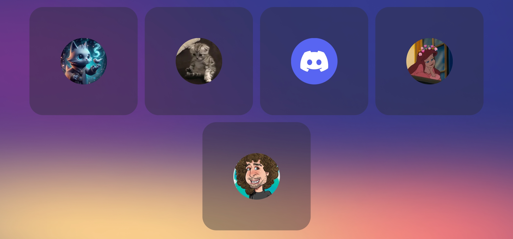</td>
<td style="width: 25%;">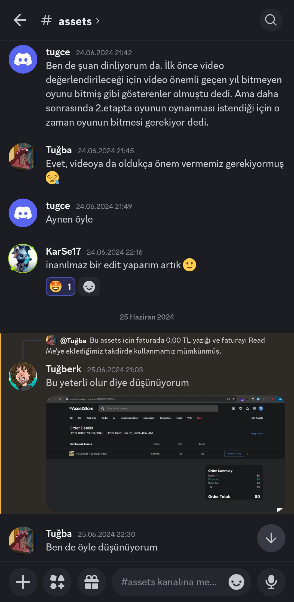</td>
<td style="width: 25%;">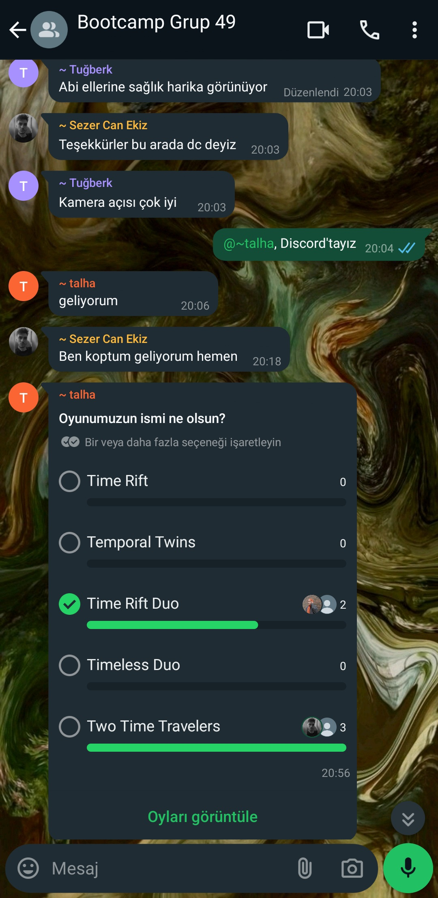</td>
<td style="width: 25%;">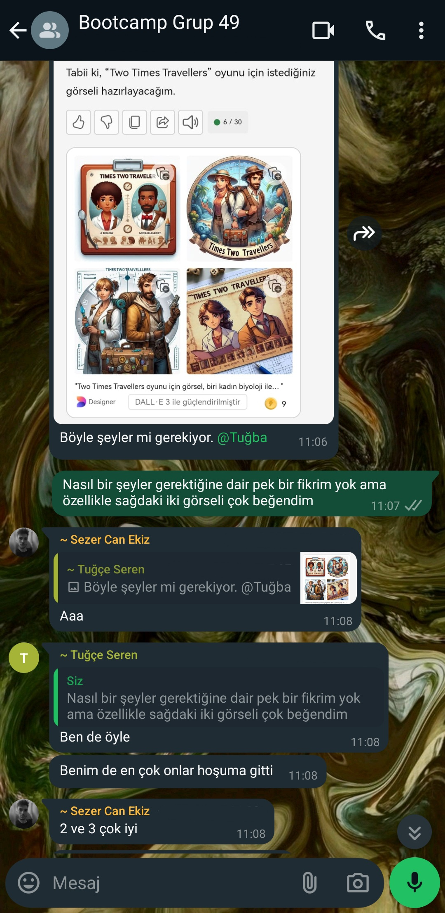</td>

   
  </table>
  
   

  

    
<h2>Sprint Board Update Ekran Görüntüleri</h2>

  [Product Backlog Board (Trello)](https://trello.com/invite/b/0pl6nN8f/ATTI436a945bff0a6c95c94b48082c602e09D85D90D6/team-board)

  

    
  
  

  

    
<h2>Oyun İçinden Ekran Görüntüleri</h2>

  <table style="width: 100%;">
    
   
   
   
    
  </table>
  
   

 

  

   **Sprint Review**
Level sayısına, karakterlere ve oyunun low poly bir tasarıma sahip olmasına karar verilmiştir. 

   **Sprint Review Katılımcıları:** *Sezer Can Ekiz, Talha Kemal Eski, Tuğba İlerisoy, Tuğberk Şentepe, Tuğçe Seren Karasürmeli*
  
   **Sprint Retrospective**
   
   - Takım içinde görev ve rol dağılımları yapılmıştır.
   - Takım içi rollerde düzenleme yapılmış, scrum master değişmiştir.
   - Takım üyelerinin iletişime daha açık olması gerektiği vurgulanmıştır.

  

  ---

  

    
<h1>Sprint 2</h1>

   

   
<h2>Sprint Notları</h2>

  Sprint içi tamamlanması beklenen puan 100 olup 80 puan tamamlanmıştır. Map tasarımı ve controller yapımı 3. sprint'de de devam edecektir.
  
   *Puanlama mantığı:*

    
**Controller Seçme ve Yapma**

- Tamamlanması beklenen puan: 25
- Tamamlanma durumu: 15 puan

**Map Tasarımı (3 adet)**

- Her bir map için tamamlanması beklenen puan: 10
- Tamamlanmayan mapler: 5 puan
- Tamamlanma durumu: 20 puan

**Multiplayer ve Lobby Sistemleri**

- Tamamlanması beklenen puan: 20
- Tamamlanma durumu: 20 puan

**Ekran Bölme Mekaniği**

- Tamamlanması beklenen puan: 25
- Tamamlama durumu: 25 puan
- Tamamlanmış Puanlar: 80 puan

**Açıklama**
- Controller Seçme ve Yapma: Teknik zorluklar ve buglar nedeniyle beklenen seviyede tamamlanamadı, bu yüzden düşük puan verildi.
- Map Tasarımı: Her bir harita için eşit puan, bitmemiş harita için yarım puan verilmiştir.
- Multiplayer ve Lobby Sistemleri: Başarıyla tamamlandığı için  tam puan verildi.
- Ekran Bölme Mekaniği: Başarıyla tamamlandığı için tam puan verildi.

 

    
<h2>Daily Scrum</h2>

      Görüşmeler WhatsApp ve Discord grupları aracılığıyla sağlanmıştır.
  <table style="width: 100%;">
    
<td style="width: 25%;">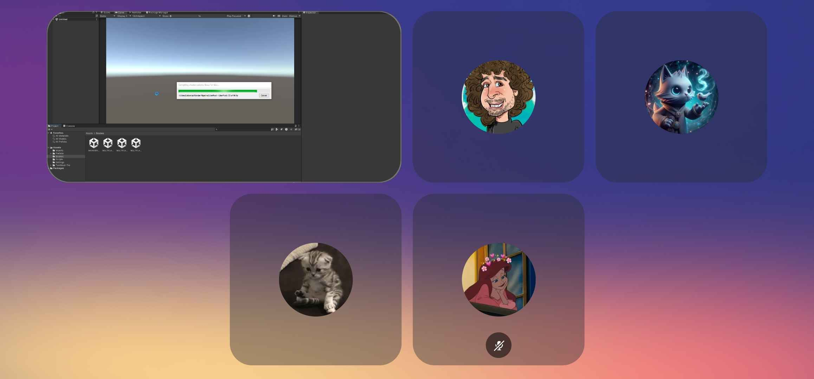</td>
<td style="width: 25%;">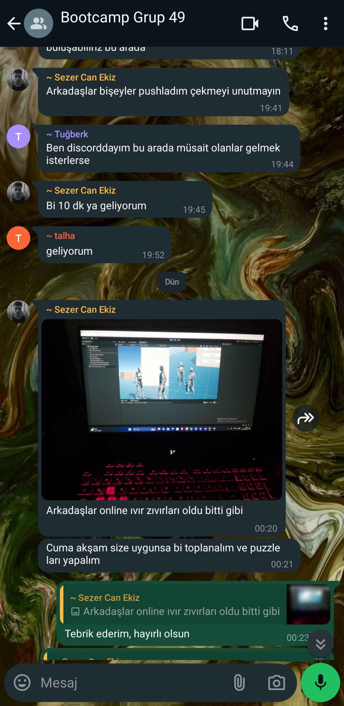</td>

   
  </table>
  
   

  

    
<h2>Sprint Board Update Ekran Görüntüleri</h2>

   [Product Backlog Board (Trello)](https://trello.com/invite/b/0pl6nN8f/ATTI436a945bff0a6c95c94b48082c602e09D85D90D6/team-board)

  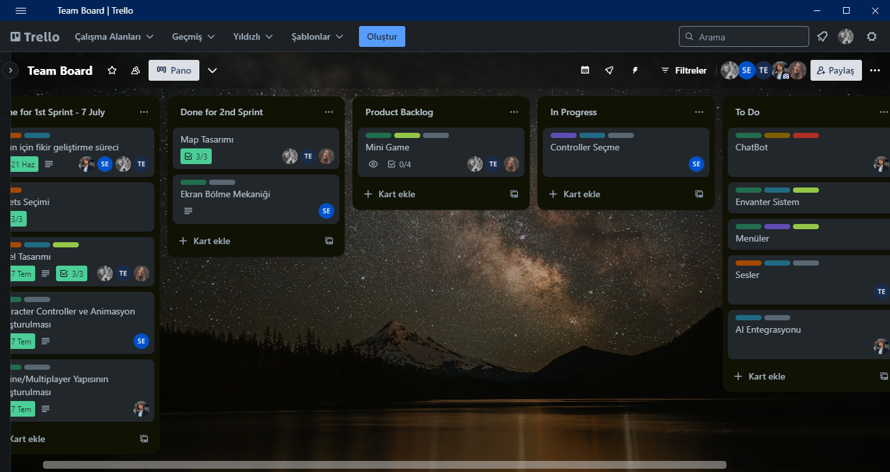

  
  

  

    
<h2>Oyun İçinden Ekran Görüntüleri</h2>

  <table style="width: 100%;">
    
   
   
   
   

     
    
  </table>
  
   

 

  

   **Sprint Review**
- Level sıralamasına ve oyun içi kontrollere karar verilmiştir ve hikâye oluşturulmuştur.
- Multiplayer ve lobby sistemleri kurulmuştur.
- Mini Game/Puzzle türleri seçilmiştir.
- Eş zamanlı oyun deneyimi denenmiştir.

   **Sprint Review Katılımcıları:** *Sezer Can Ekiz, Tuğba İlerisoy, Tuğberk Şentepe*
  
 **Sprint Retrospective**
      - Seviye içerisindeki bulmaca sayısı belirlenmiştir.
      - Puzzle'lar için görev dağılımı yapılmıştır.
      - Takım üyelerine çalışmaları hızlandırması gerektiği vurgulanmıştır.

  

  ---

 

    
<h1>Sprint 3</h1>

    
  

<h2>Sprint Notları</h2>

   Sprint içi tamamlanası beklenen puan 100'dür ve 100 tam puan tamamlanmıştır.

   *Puanlama Mantığı:*
   "Mini Game, Controller Seçme, Envanter Sistem, Oyun İçi Hedefler, Ses Seçimi, Menü Dizaynı, AI Entegrasyonu, Oyun İçi Diyalog Ekleme, UI Seçme ve NPC Kontrolü" olmak üzere her hedef 10 puan olacak şekilde belirlenmiştir. Tüm hedefler tamamlanmış ve sprintte 100 tam puana ulaşılmıştır.

  

 

 

    
<h2>Daily Scrum</h2>

      Görüşmeler WhatsApp ve Discord grupları aracılığıyla sağlanmıştır.
  <table style="width: 100%;">
    
<td style="width: 25%;">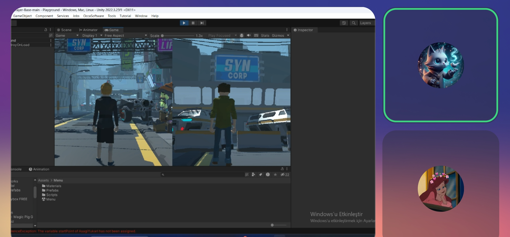</td>
<td style="width: 25%;">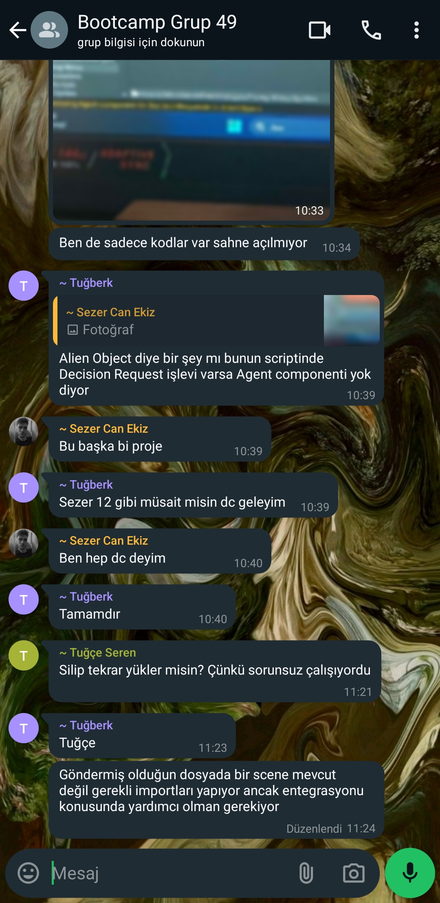</td>
<td style="width: 25%;">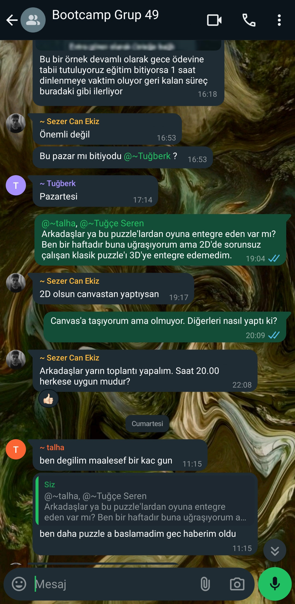</td>

   
  </table>
  
   

  

    
<h2>Sprint Board Update Ekran Görüntüleri</h2>

   [Product Backlog Board (Trello)](https://trello.com/invite/b/0pl6nN8f/ATTI436a945bff0a6c95c94b48082c602e09D85D90D6/team-board)

  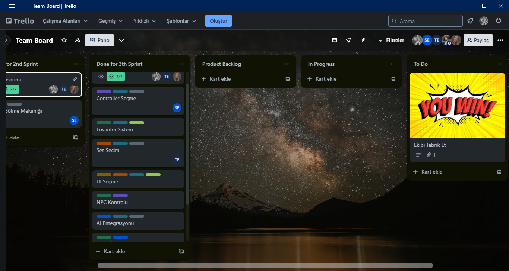

  
  

  

    
<h2>Oyun İçinden Ekran Görüntüleri</h2>

  <table style="width: 100%;">
    
   
   
   
   

     
    
  </table>
  
   

 

  

   **Sprint Review**
- Kullanıcı arayüzü iyileştirildi ve yeni butonlar eklendi.
- Karakter animasyonları geliştirildi.
- Performans optimizasyonu sırasında beklenmedik hatalarla karşılaşıldı ve bazı görevler iptal edildi.
- Mini oyunlar geliştirildi ve oyun içine entegre edildi.
- Map oluşturma tamamlanmıştır.

   **Sprint Review Katılımcıları:** *Sezer Can Ekiz, Tuğba İlerisoy*
  
 **Sprint Retrospective**
- Oyun gidişatındaki sorunlar konuşulmuş ve yetişmeyecek özellikler çıkartılmıştır.
- Oyun içindeki görev yerleri belirlenmiştir.
- Oyun hikâyeleştirilmesi yapılmıştır.
- Takım üyelerine diğer projelerde daha aktif olmaları gerektiği konuşulmuştur.

  

  ---

  

  
<h1>Notlar</h1>

  Oyunda kullanılan kodlar genel olarak ThirdPersonController dosyasında bulunmaktadır.
  
  

    
<h2>Kaynaklar</h2>

    
   

      
<h3>Görsel Kaynaklar</h3>

     
  [Geçmiş Paketi](https://unityassetcollection.com/polygon-western-pack-free-down1load/)
  
  [Şimdiki Zaman Paketi](https://assetstore.unity.com/packages/3d/environments/polygon-sampler-pack-207048)

  [Gelecek Paketi](https://unityassetcollection.com/polygon-sci-fi-city-pack-free-download/)
  
  [Skybox Paketi](https://assetstore.unity.com/packages/3d/environments/simple-sky-cartoon-assets-42373)
  
  [Geçmiş Map'indeki Ev](https://www.cgtrader.com/items/3708693/download-page)
  
  [Nişangâh İkonu](https://assetstore.unity.com/packages/2d/gui/icons/crosshairs-216732)

  [Kapı Paketi](https://assetstore.unity.com/packages/3d/props/interior/free-wood-door-pack-280509)

  [Kilit Sistemi](https://assetstore.unity.com/packages/2d/gui/keypad-62942)
  
   Gelecek zaman reklam panosunda, oyun logosunda ve Read Me görseli üretiminde Copilot kullanılmıştır.
    

    
  

      
<h3>Ses Kaynakları</h3>

    
    [Menü Müziği](https://freesound.org/people/Sunsai/sounds/415805/)
  
    

  

  
  

    
<h2>Faturalar</h2>

    Oyunda kullanılan Polygon Educational Bundle paketinin faturasıdır:
    <td style="width: 25%;">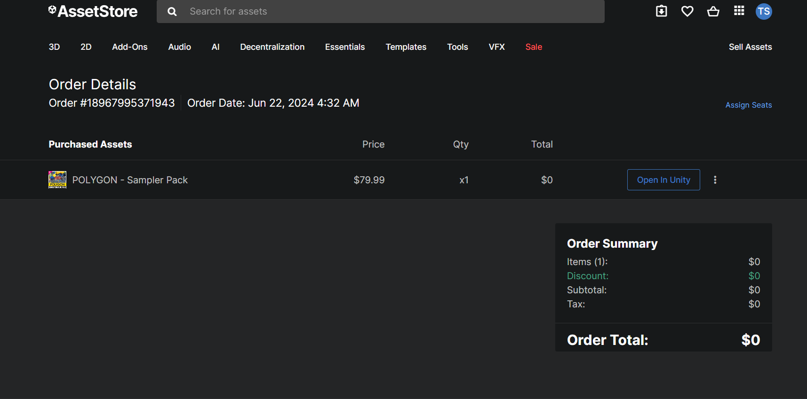</td>
   
  

